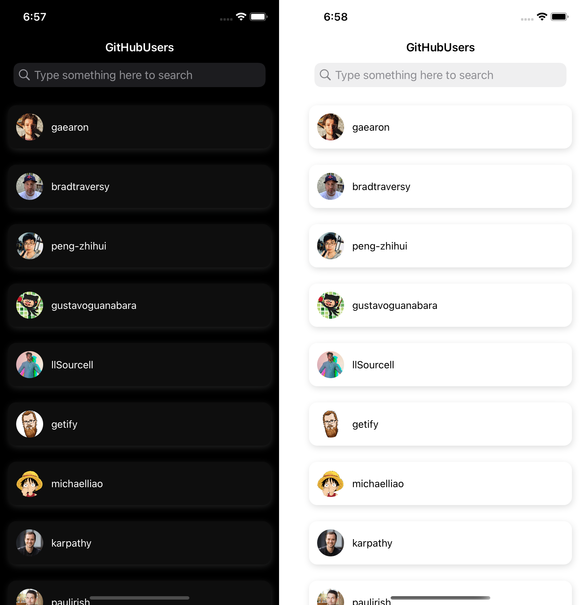

# gitHubUsers

> Note: For prooper api requests working, add guthub token in the gitHubUsers/gitHubUsers/API/Environment.swift instead of YOUR_TOKEN.

The app shows the list of GitHub users and their short details.

## Features

- Search and filter
- No external dependencies

## LICENSE

MIT
